# Python Quiz

The Python Quiz is a short knowledge test about python for newbies with 10  multiple choice questions.
The institutions that offer python courses could apply the quiz to their students and analyze the data to see what the students have the most difficulty with. The spreadsheet can be used to generate graphs to facilitate data analysis. 

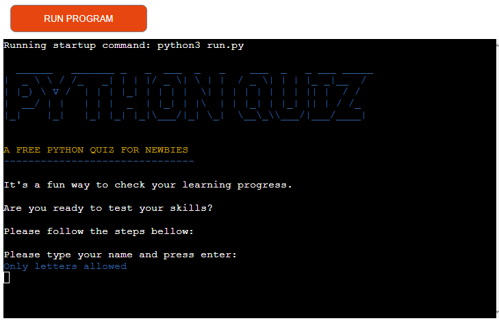


## Demo

A live demo can be found [here](https://quizpython.herokuapp.com/). The Application was deployes by Heroku.

- - -

# Contents
* [Technologies Used](#technologies-used)
* [User Experience](#user-experience-ux)
* [Design](#design)
  * [Flowchart](#flowchart)
  * [Existing Features](#existing-features)
  * [Future Implementations](#future-implementations)
* [Deployment](#deployment)
  * [Heroku Deployment](#heroku-deployment)
  * [Run locally](#run-locally)
  * [Create data model and integrate using an API](#create-data-model-and-integrate-using-an-api)
* [Testing](#testing)
* [Credits](#credits)

- - - 

# Technologies Used
## Language
* Python3

## Libraries
* os 
* time
* colorama
* pyfiglet

## Frameworks & Tools
* Heroku Platform - to deploy the application into live enviroment
* Gitpod - to create the website
* Github - to store the repository of website and deploy it
* Google Sheets API: to handle the data automation.
* [Draw](https://app.diagrams.net/) - to draw a flowchart

For this project a [Code Institute template](https://github.com/Code-Institute-Org/python-essentials-template), which provides all the files I needed to run the mock terminal in the browser.

The questions and options are collected from the questions worksheet and the choices from update the answers worksheet. 


- - - 

# User Experience (UX)

## The ideal users for this website is:
* Users who are learning Python and want to test their knowledge.


## User stories:

* As a new user, I expetc to easily to have an idea of what the program is about.
* I want to be guided and informed how I can play the quiz 
* I want to have a clear feedback from inputs
* I want to have option either to play again or to exit the program
* I expect to restart the quiz 

## How to play:

- Firstly, the user needs to enter a valid name to start the game.
- Secondly, the user can read the instructions.
- Thirdly, the quiz will start and the user needs to guess a, b, c or d as his/her choice.
- The score increases by one for each right choice.
- After the 10 questions, the user's score will be displayed.
- Finally, the user will be asked if he/her wants to play again.

- - -
# Design

Due to the template that is added in the front-end files needed to give the users a way to interact with this project in a fake terminal on a web page, no changes in other files were needed.

## Flowchart
This Flowchart was created using drawio to summarise the structure and logic of the application.


## Existing Features

### Introduction
- Once the user runs the program, Python Quiz is dsplayed.

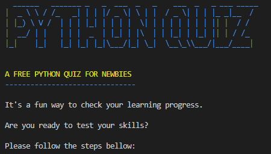

### Username

- User is asked to enter his/her name using letters only.

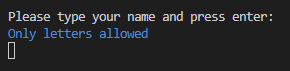

- When the user enters a valid name, the instructions are displayed.

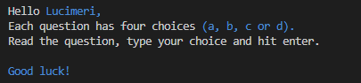

- If user enters a invalid name, he will be asking for a valid username again.


### Quiz

- After the instructions have been displayed, the quiz will start automatically. The questions are presented separately with four options. The user is guided to choose a, b, c or d.

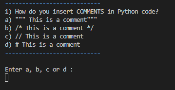

### Feedback on each question

- If the user's choice is valid, it will be displayed whether he got it right or wrong.

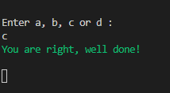

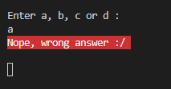

- If the input is invalid, the user will be asked until his choice is valid.

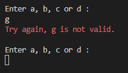

### Score

- After the 10 questions the score will be displayed.

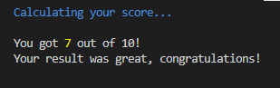

### Play again

- The user will be asked if he wants to play again or not.

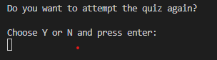

- If the user wants to play again a message to try again will be displayed for 2 seconds and after that the quiz will start again.

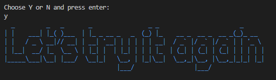

- If the user doesn't want to play again a a thank you message will be displayed and the application exits.

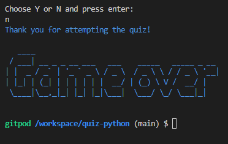

### Run program button
- The user can press the "RUN PROGRAM" button at any time to restart the program.


### Update the spreadsheet
- The answers worksheet is updated correctly.
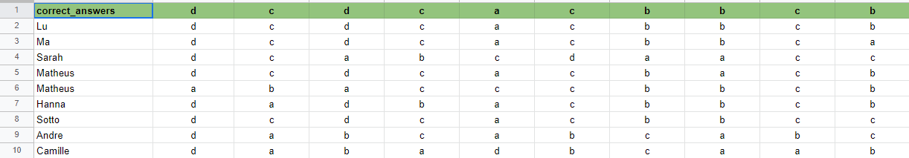


## Future Implementations
- Various question levels
- Library of questions to be used randomly
- Graphs to evaluate which questions had the most hits or errors, error and hit percentages for each question. 

Graphical libraries will not deploy to heroku and deployment is necessary for completion and submission of my project.

- - -
# Deployment
Gitpod IDE was used to write the code for this project and the Application has been deployed from GitHub to Heroku using the steps below with version releasing active.

## Heroku Deployment
Deployments steps are as follows, after account setup:

* Select New in the top-right corner of your Heroku Dashboard, and select Create new app from the dropdown menu.
* Add a unique app name and then choose a region closest to you (EU or USA).
* Click on Create App.

In order for the project to run on Heroku, Heroku is needed to install the dependencies. 
* In the terminal write the following commando `pip3 freeze > requirements.txt` to create a list of requirements. The list of dependencies will go into `requirements.txt` file.

The sensitive data needs to be kept secret and Heroku will build the app using the code in the Github. The creds.json file is protected in gitignore file and these credentials are needed in order to connect to API. To allow the Heroku Application to access the spreadsheet the following steps are needed:

* From the new app Settings, click Reveal Config Vars, and set the value of KEY to **CREDS** (all capital letters), and go to the repository, copy the entire`creds.json` then paste it into the VALUE field. Then click "Add". Add another KEY called **PORT** and VALUE **8000**, then click "Add".
* Further down, to support dependencies, select Add Buildpack.
* The order of the buildpacks is important, select Python first, then click "Save changes". Then add Node.js second and click "Save changes" again. If they are not in this order, you can drag them to rearrange them.
* Go to "Deploy" and select "GitHub" in "Deployment method".
* To connect Heroku app to your Github repository code enter your repository name, click 'Search' and then 'Connect' when it shows below
* Choose the branch you want to buid your app from.
* If prefered, click on "Enable Automatic Deploys", which keeps the app up to date with your GitHub repository.
* Wait for the app to build. Once ready you will see the “App was successfully deployed” message and a 'View' button to take you to your deployed link.

[GitHub repository](https://github.com/luandretta/quiz-python) 


## Run locally

**Making a Local Clone**
1. Login or Sign Up to GitHub.
2. Open the project [repository](https://github.com/luandretta/quiz-python).
3. Click on the code button, select whether you would like to clone with HTTPS, SSH or GitHub CLI and copy the link shown.
4. Open the terminal in the code editor of your choice and change the current working directory to the location you want to use for the cloned directory.
5. Type 'git clone' into the terminal and then paste the link you copied in step 3. Press enter.

Add the files in your new local repository. This stages them for the first commit:
```bash
$ git add .
```

To unstage a file, use:
```bash
$ git reset HEAD YOUR-FILE
```

Commit the files that you've staged in your local repository:
```bash
$ git commit -m "First commit"
# Commits the tracked changes and prepares them to be pushed to a remote repository. To remove this commit and modify the file, use 'git reset --soft HEAD~1' and commit and add the file again.
```

Push the changes in your local repository to GitHub.com:
```bash
$ git push origin main
# Pushes the changes in your local repository up to the remote repository you specified as the origin
```

**Forking the GitHub Repository**
To fork this website to either propose changes or to use as an idea for another website, follow these steps:
1. Login or Sign Up to GitHub.
2. Open the project [repository](https://github.com/luandretta/quiz-python).
3. Click the Fork button in the top right corner.
4. Copy of the repository will be in your own GitHub account.

To deploy from GitHub, follow these steps:

1. Log into your GitHub repository, create a GitHub account if necessary.
2. Click 'Settings' in the main Repository menu.
3. Click 'Pages' from the left-hand side navigation menu.
4. Within the Source section, click the "Branch" button and change from 'None' to 'Main'.
5. The page should automatically refresh with a url displayed.
6. Test the link by clicking on the url.

The url for this website can be found [here](https://quizpython.herokuapp.com/) 

## Create data model and integrate using an API

- **Create a Spreadsheet (Data Model)**

1. Login to your Google account, create an account if necessary.
2. Navigate to Sheets, Googles version of Microsoft Excel.
3. Start a new spreadsheet, amend the title at the top i.e., quiz_python.
4. Create 2 Sheets/Tabs, titling 'questions' and 'answers'.
5. Add the data according to the screenshot in [Used-technologies](#used-technologies).


- **Setup API**

1. Navigate to Google Cloud Platform.
2. If you do not already have a profile then follow the basic steps for creating an Account, via clicking on the 'Get Started for Free' button in the upper right corner.
3. Once the previous step is complete, create a new project with a unique title.
4. Click on the "Select Project" button to bring you to your project page.
5. You should now arrive at the project dashboard and be ready to setup the required credentials:
- Access the navigation menu from clicking on the burger icon (three horizonal lines menu icon) in the top left corner of the page.
- Select APIs and Services, followed by 'Library'.
- Search for and select Google Drive API -> Enable.
- Search for and select Google Sheets API -> Enable.
- Click Enable to navigate to 'API and Services Overview'.
- Click Create Credentials in the upper left of the screen.
- For Credential Type, select 'Google Drive' from the dropdown.
- For 'What data will you be accessing' select Application Data.
- For 'Are you planning to use this API with Compute Engine...?' choose 'No, I'm not...'.
- Click Next.
- Within the Create Service Account page, enter a Service Account Name, then click Create.
- Next within 'Grant this service account access to project', choose Basic -> Editor from the 'Select a Role' dropdown and click Continue.
- Next within 'Grant users access to this service account', choose 'Done'.
- On the following, click on the 'Service Account Name' you created to navigate to the config page.
- Navigate to the Keys section.
- Select 'Add Key' dropdown -> Create New Key.
- Select 'JSON' and then click Create. This will trigger the json file with your API credentials in it to download to your machine.
- Go back to the library and search for "google sheets".
- Click Enable.
- From your local downloads folder, add file directly to your Gitpod workspace, and rename the file to creds.json.
- Within the file, copy the value for 'client email'. 
- Paste this email address into the 'Share' area of your Google Sheet, assigning the role of Editor, untick "Notify People" and then click "share".


Enable API within IDE

- From within your GitPod IDE terminal, enter 'pip3 install gspread google-auth'.

- At the top of your Python file add the following lines:
```python
import gspread
from google.oauth2.service_account import Credentials
```

- Below this add the following code:
```phyton
    SCOPE = [
        "https://www.googleapis.com/auth/spreadsheets",
        "https://www.googleapis.com/auth/drive.file",
        "https://www.googleapis.com/auth/drive"
       ]

CREDS = Credentials.from_service_account_file("creds.json")
SCOPED_CREDS = CREDS.with_scopes(SCOPE)
GSPREAD = gspread.authorize(SCOPED_CREDS)
SHEET = GSPREAD.open("quiz_python")
```

---
# Testing 
The different aspects of the site work as intended and have an expected outcome providing an easy and straightforward way for the users to achieve their goals.
The terminal was used during the development of the application to identify and resolve any issues as it progressed, testing correct and incorrect user inputs.

## Functionality
### Validator
CI Python Linter was used to validate this project, no errors were returned.
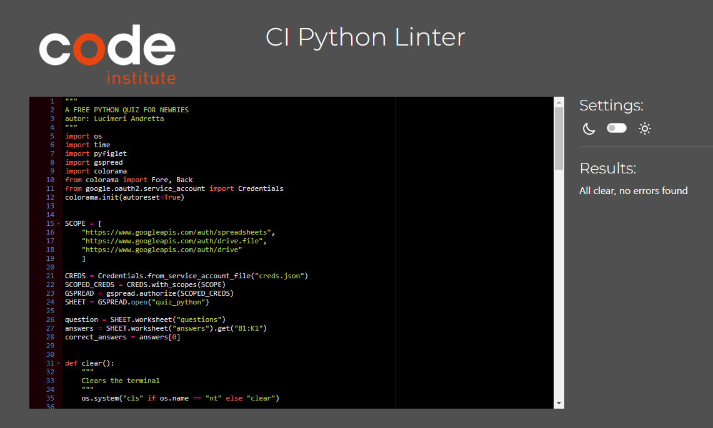

### Manual: 

|N.| Test Label | Test Action | Expected Outcome | Test Outcome |
|:---|:--- |:--- |:--- |:--- |
|1| Type valid username | On input field, attempt to type a valid username (only alpha caracters) | Username was valid and the application continues| PASS |
|2| Type invalid username | On input field, attempt to type a invalid username (with numbers) | Username was invalid and user needs to enter a valid username | PASS |
|3| Type whitespaces before username | On input field, attempt to type a valid username (only alpha caracters) | Username was valid and the application continues| PASS |
|4| Quiz questions| The quiz starts with the first question, after a valid choice from user, runs the following question | All questions are displayed correctly| PASS |
|5| Valid choice | On input field, attempt to type a valid choice (a, b, c or d) | Choice was valid and the quiz continues| PASS |
|6| Invalid choice | On input field, attempt to type a invalid choice (number, empty and other invalid alpha) | Choice was invalid and user needs to enter a valid choice to continue the quiz| PASS |
|7| Display correct answer| Type a correct answer | It displays a message confirming the correct choice| PASS |
|8| Display incorrect answer| Type a incorrect answer | It displays a message confirming the incorrect choice| PASS |
|9| Score 10 | Attempt to score 10 | The score increases by one for each right choice and total = 10| PASS |
|10| Score 5 | Attempt to score 5 | The score increases by one for each right choice and total = 5| PASS |
|11| Score 0 | Attempt to score 0 | The score will be 0 | PASS |
|12| Final message score >= 7 | Score 7 or more  | It displays a congratulation message correctly | PASS |
|13| Final message score < 7 | Score < 7  | It displays an enconraging message to try the quiz again | PASS |
|14| Play again | User wants to play again and enters y| The quiz starts again asking username| PASS |
|15| Exit | User doesn't want to play again and enters n| The quiz ends| PASS |
|16| Invalid Input (Y/N) | Type invalid letter | A valid input is required| PASS |
|17| Invalid Input (Y/N) | Type  number | A valid input is required| PASS |
|18| Invalid Input (Y/N) | Empty input | A valid input is required| PASS |
|19| Input with whitespace (Y/N) | Attempt to leave some whitespaces before valid input | Input is valid| PASS |
|20| Input y or n | Type y in smallcase | Input is valid| PASS |
|21| Restart Game Button| Click on the restart game button| The quiz restarts | PASS |
|22| Update the worksheet| Check the answers in the worksheet| The worksheet was updated with user answers correctly| PASS |
|23| Colors | Run the quiz | Text colors are displayed according to code | PASS |

Video recorded and edited with testing:


## Compatibility
The website displays correctly across different browsers and screen sizes.

It was checked on Chrome, Firefox, Safari and Edge. Using Safari, only the sans-serif font in the header is displayed and not the Ubuntu, but this does not affect the performance of the site.


## Solved bugs
* When the correct answers from the spreadsheet were accessed for comparison with the user's guesses, the correct answers returned a list with a list.

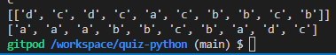

Fixed this with another variable accessing index zero of the list, which contains all the correct answers.

```
  answers = SHEET.worksheet("answers").get("B1:K1")
  correct_answers = answers[0]
```

* To update the sheet with username and its answers was used append, however the focus was not the username but the answers, so the append method was changed to insert for the updated sheet with the row order properly.

* Added docstring to the first line.

* The Python Quiz logo was showing up after call clear. If the user scrowlls the screen up, he/she could see the half of the logo. Fixed the function clear with print('\033c') and not using os.


The following changes or additions were made as advised by my mentor, not considered as bugs, but for code improvement:

* Used strip() on inputs to remove unwanted leading or trailing spaces.
* Better explanation of input requirements.
* Descriptive name instead of using i or j.
* Add a main function 
* Add a ``` __name__ == “__main__” ``` to control the execution of the script.

# Credits
## Code
The following sources were used for this project:
- Python Essentials from [Code Institut](https://codeinstitute.net/de/)
- [Gspread](https://docs.gspread.org/en/latest/user-guide.html#getting-all-values-from-a-row-or-a-column)
- [Develop Google Sheets solutions](https://developers.google.com/sheets/api/guides/values)
- [W3 Schools](https://www.w3schools.com/python/default.asp#gsc.tab=0)
- [Data Camp](https://www.datacamp.com/tutorial/for-loops-in-python)
- [Python.org](https://peps.python.org/pep-0008/#introduction)
- [Stack overflow](https://stackoverflow.com/questions/21939652/insert-at-first-position-of-a-list-in-python)
- [Dev Dungeon](https://www.devdungeon.com/content/create-ascii-art-text-banners-python#use_pyfiglet_python)
- [Markdown Guide](https://www.markdownguide.org/extended-syntax/#tables)
- [Conventinal Commits](https://www.conventionalcommits.org/en/v1.0.0/) 


## Acknowledgements
* To my amazing family for their patiences.

* To God, who guides me to find all the guidance I need to program.

* My Mentor Brian Macharia for continuous helpful feedback.

- - - 

Developed By Lucimeri Andretta for Code Institute's Portfolio Project 3 - 2023
Feel free to connect with me on [Linkedin](www.linkedin.com/in/luandretta) :)
